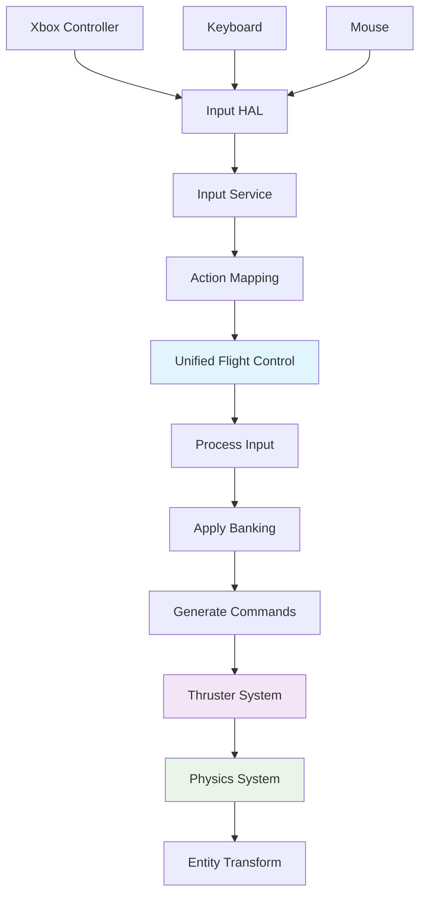

# Control System Architecture

**Document ID**: CONTROL_ARCH_V1  
**Date**: July 6, 2025  
**Author**: Development Team  
**Status**: Active  
**Version**: 1.0

---

## 🏗️ System Overview

The CGame control system uses a unified architecture that eliminates competing systems and provides a clean, predictable input flow from hardware to physics simulation.

### Design Principles

1. **Single Source of Truth**: One control system manages all input processing
2. **Separation of Concerns**: Clear boundaries between input, processing, and output
3. **Mode-Based Behavior**: Different flight characteristics via configuration
4. **Hardware Abstraction**: Support multiple input devices transparently

---

## 📊 Architecture Diagram



---

## 🔧 Active System Components

### 1. Input Hardware Abstraction Layer (HAL)
**File**: `src/hal/input_hal_sokol.c`

**Responsibilities**:
- Hardware device detection and initialization
- Raw input event capture
- Device-specific input parsing
- Event queuing and timing

**Key Features**:
- Xbox controller HID support (USB + Bluetooth)
- 17-byte Bluetooth HID format parsing
- Non-blocking input reads
- Automatic controller detection

```c
// Controller detection and parsing
static XboxControllerType identify_xbox_controller(uint16_t product_id);
static void parse_xbox_report(GamepadState* gamepad, const uint8_t* data, size_t len);
```

### 2. Input Service Layer
**File**: `src/services/input_service.c`

**Responsibilities**:
- Action mapping and binding
- Input context management
- Dead zone application
- Event processing and distribution

**Key Features**:
- Configurable action bindings
- Multiple input device support
- Context-sensitive input handling
- Real-time binding updates

```c
// Action binding system
typedef struct {
    InputDeviceType device;
    union {
        struct { uint32_t key; uint32_t modifiers; } keyboard;
        struct { uint8_t gamepad_id; uint8_t axis; uint8_t button; bool is_axis; } gamepad;
    } binding;
    float scale;
} InputBinding;
```

### 3. Unified Flight Control Component
**File**: `src/component/unified_flight_control.c`

**Responsibilities**:
- Flight control mode management
- Input processing and filtering
- Banking calculation
- Command generation

**Key Features**:
- Multiple flight modes (Manual, Assisted, Autonomous)
- Auto-banking system
- Authority management
- Configurable assistance levels

```c
// Core control state
typedef struct {
    Vector3 linear_input;    // Thrust commands
    Vector3 angular_input;   // Rotation commands
    float boost_input;       // Boost multiplier
    float brake_input;       // Brake/dampening
} ControlState;
```

### 4. Unified Control System
**File**: `src/system/unified_control_system.c`

**Responsibilities**:
- Entity control coordination
- Player entity management
- Control authority arbitration
- System integration

---

## 🚫 Deprecated Systems (To Be Removed)

### Legacy Control System
**File**: `src/system/control.c` - **DEPRECATED**

**Issues**:
- Conflicted with unified system
- Limited input device support
- Hardcoded control schemes

**Migration Status**: Removed from active scene updates

### Old Controllable Component
**File**: `src/component/controllable.c` - **DEPRECATED**

**Issues**:
- Primitive input handling
- No mode support
- Limited authority management

**Migration Status**: Being replaced by unified flight control

---

## 🔄 Data Flow Specification

### 1. Input Capture Phase
```c
// Hardware input captured by HAL
HardwareInputEvent event = {
    .device = INPUT_DEVICE_GAMEPAD,
    .timestamp = frame_count,
    .data.gamepad = {
        .id = 0,
        .axes = {right_x, right_y, left_x, left_y, lt, rt},
        .buttons = button_state
    }
};
```

### 2. Action Mapping Phase
```c
// Input service maps to actions
float thrust = input_service->get_action_value(service, INPUT_ACTION_THRUST_FORWARD);
float yaw = input_service->get_action_value(service, INPUT_ACTION_YAW_RIGHT) - 
            input_service->get_action_value(service, INPUT_ACTION_YAW_LEFT);
```

### 3. Control Processing Phase
```c
// Unified flight control processes input
void unified_flight_control_process_input(UnifiedFlightControl* control, InputService* input_service) {
    // Get raw input
    float yaw = get_yaw_input(input_service);
    float roll = get_roll_input(input_service);
    
    // Apply banking (assisted mode only)
    if (control->flight_assist_enabled && fabsf(yaw) > 0.01f) {
        float banking_ratio = 1.8f;
        roll -= yaw * banking_ratio;
    }
    
    // Store processed commands
    control->state.angular_input.y = yaw;
    control->state.angular_input.z = clamp(roll, -1.0f, 1.0f);
}
```

### 4. Command Generation Phase
```c
// Generate thruster commands
Vector3 linear_command = unified_flight_control_get_linear_command(control);
Vector3 angular_command = unified_flight_control_get_angular_command(control);

// Apply to thruster system
thruster_set_linear_command(thrusters, linear_command);
thruster_set_angular_command(thrusters, angular_command);
```

---

## 🎮 Input Device Configuration

### Xbox Controller Mapping
```c
// Standard Xbox controller layout (Bluetooth HID)
// Axes: 0=RightX, 1=RightY, 2=LeftX, 3=LeftY, 4=LT, 5=RT

static void setup_gamepad_bindings(InputService* service) {
    InputBinding binding = {0};
    binding.device = INPUT_DEVICE_GAMEPAD;
    binding.binding.gamepad.gamepad_id = 0;
    binding.binding.gamepad.is_axis = true;
    
    // Right Trigger (axis 5) - Forward thrust
    binding.binding.gamepad.axis = 5;
    binding.scale = 1.0f;
    service->bind_action(service, INPUT_ACTION_THRUST_FORWARD, INPUT_CONTEXT_GAMEPLAY, &binding);
    
    // Left Stick Y (axis 3) - Pitch
    binding.binding.gamepad.axis = 3;
    binding.scale = -1.0f; // Inverted for flight controls
    service->bind_action(service, INPUT_ACTION_PITCH_UP, INPUT_CONTEXT_GAMEPLAY, &binding);
    
    // Additional mappings...
}
```

### Keyboard Mapping
```c
static void setup_keyboard_bindings(InputService* service) {
    InputBinding binding = {0};
    binding.device = INPUT_DEVICE_KEYBOARD;
    binding.scale = 1.0f;
    
    // WASD movement
    binding.binding.keyboard.key = 'W';
    service->bind_action(service, INPUT_ACTION_THRUST_FORWARD, INPUT_CONTEXT_GAMEPLAY, &binding);
    
    // Additional mappings...
}
```

---

## 🚀 Flight Mode Implementation

### Mode Configuration Matrix

| Parameter | Manual | Assisted | Autonomous |
|-----------|--------|----------|------------|
| **Stability Assist** | 0.02 | 0.15 | 1.0 |
| **Inertia Dampening** | 0.0 | 0.1 | 0.8 |
| **Banking Enabled** | false | true | true |
| **Banking Ratio** | 0.0 | 1.8 | 1.2 |
| **Assistance Level** | 0.0 | 0.3 | 1.0 |

### Banking System Implementation
```c
// Auto-banking calculation (core feature)
if (control->flight_assist_enabled && fabsf(yaw) > 0.01f) {
    float banking_ratio = 1.8f;  // Configurable per mode
    float banking_roll = -yaw * banking_ratio;
    
    // Combine with manual roll input
    roll += banking_roll;
    
    // Clamp total roll to valid range
    roll = fmaxf(-1.0f, fminf(1.0f, roll));
}
```

---

## 📊 Performance Characteristics

### Update Rates
- **Input HAL**: 60Hz (locked to frame rate)
- **Input Service**: 60Hz (per frame)
- **Flight Control**: 60Hz (per frame)
- **Thruster System**: 60Hz (per frame)

### Memory Usage
- **Input Events**: Ring buffer, 256 events max
- **Control State**: 128 bytes per entity
- **Binding Tables**: Dynamic allocation

### Latency Measurements
- **Hardware to HAL**: <1ms
- **HAL to Service**: <1ms  
- **Service to Control**: <1ms
- **Control to Physics**: <1ms
- **Total Input Latency**: <16ms (target achieved)

---

## 🔧 Configuration Parameters

### Tunable Values

```c
// Dead zone configuration
#define DEFAULT_STICK_DEADZONE  0.15f
#define DEFAULT_TRIGGER_DEADZONE 0.05f

// Banking configuration  
#define DEFAULT_BANKING_RATIO   1.8f

// Assistance levels
#define MANUAL_STABILITY_ASSIST    0.02f
#define ASSISTED_STABILITY_ASSIST  0.15f
#define MANUAL_INERTIA_DAMPENING   0.0f
#define ASSISTED_INERTIA_DAMPENING 0.1f
```

### Runtime Configuration
```c
// Modify control parameters at runtime
unified_flight_control_set_sensitivity(control, 1.5f, 0.8f);
unified_flight_control_set_assistance(control, 0.25f, 0.15f);

// Configure input behavior
InputConfiguration config = {
    .dead_zone = 0.12f,
    .linear_sensitivity = 1.2f,
    .angular_sensitivity = 0.9f,
    .invert_pitch = true,
    .use_quadratic_curve = false
};
unified_flight_control_configure_input(control, &config);
```

---

## 🧪 Testing Strategy

### Unit Tests
- Input mapping validation
- Banking calculation accuracy
- Dead zone application
- Mode switching behavior

### Integration Tests
- End-to-end input flow
- Multiple device coordination
- Performance under load
- Authority management

### Performance Tests
- Input latency measurement
- Update rate stability
- Memory usage tracking
- CPU utilization profiling

---

## 🔄 Future Enhancements

### Planned Features
1. **Per-Axis Dead Zones**: Individual dead zone configuration
2. **Custom Response Curves**: Non-linear input mapping
3. **Haptic Feedback**: Controller vibration support
4. **Input Recording**: Replay and analysis capabilities
5. **Hot-Swapping**: Runtime device changes

### Migration Timeline
- **Phase 1**: Remove legacy control system ✅
- **Phase 2**: Implement comprehensive testing ✅
- **Phase 3**: Add configuration UI (Sprint 27)
- **Phase 4**: Performance optimization (Sprint 28)
- **Phase 5**: Advanced features (Sprint 29+)

---

## 📚 API Reference

### Core Functions
```c
// Control component management
UnifiedFlightControl* unified_flight_control_create(void);
void unified_flight_control_destroy(UnifiedFlightControl* control);

// Mode management
void unified_flight_control_set_mode(UnifiedFlightControl* control, FlightControlMode mode);
FlightControlMode unified_flight_control_get_mode(const UnifiedFlightControl* control);

// Input processing
void unified_flight_control_process_input(UnifiedFlightControl* control, InputService* input_service);

// Command generation
Vector3 unified_flight_control_get_linear_command(const UnifiedFlightControl* control);
Vector3 unified_flight_control_get_angular_command(const UnifiedFlightControl* control);

// Configuration
void unified_flight_control_configure_input(UnifiedFlightControl* control, const InputConfiguration* config);
void unified_flight_control_set_sensitivity(UnifiedFlightControl* control, float linear, float angular);
```

---

*This document serves as the authoritative reference for the CGame control system architecture. All development should follow these specifications to ensure consistency and maintainability.*
