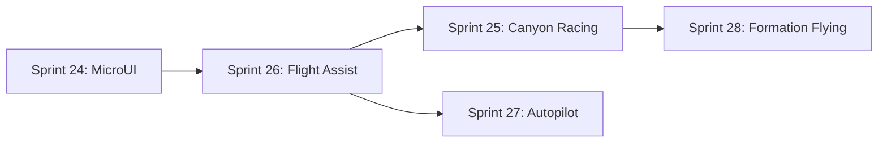

# Sprint Status Dashboard

**Document ID**: SPRINT_STATUS_DASHBOARD  
**Date**: July 6, 2025  
**Author**: Development Team

**Last Updated**: July 6, 2025  
**Status**: Active Development

## 🎯 Active Sprints

### Sprint 24: MicroUI System Fixes
- **Duration**: July 1-18, 2025 (18 days)
- **Status**: In Progress (Week 3 of 3)
- **Priority**: Critical - UI Foundation
- **Description**: Resolve MicroUI rendering issues and stabilize UI system
- **Expected Completion**: July 18, 2025

### Sprint 26: Semi-Autonomous Flight Computer System  
- **Duration**: July 7-20, 2025 (14 days)
- **Status**: Starting (Overlapping with Sprint 24)
- **Priority**: High - Core Gameplay Enhancement
- **Description**: Intelligent flight assist system for canyon racing
- **Documentation**: [`SPRINT_26_SEMI_AUTONOMOUS_FLIGHT.md`](sprints/active/SPRINT_26_SEMI_AUTONOMOUS_FLIGHT.md)

## 📋 Upcoming Sprints

### Sprint 25: Canyon Racing Prototype
- **Planned Start**: July 21, 2025
- **Duration**: 3 weeks
- **Dependencies**: Sprint 26 flight assist completion
- **Description**: Racing gameplay with flight assist integration

### Sprint 27: Waypoint Autopilot System
- **Planned Start**: August 11, 2025  
- **Duration**: 2 weeks
- **Dependencies**: Sprint 26 flight computer foundation
- **Description**: Advanced autopilot with waypoint navigation

## ✅ Recently Completed

### Sprint 23: Scripted Flight System
- **Completed**: June 2025
- **Deliverables**: Waypoint navigation, path following
- **Architecture**: `src/component/scripted_flight.h`

### Sprint 22: Camera System Enhancements  
- **Completed**: May 2025
- **Deliverables**: Improved camera controls, smooth transitions

### Sprint 21: 6DOF Physics Implementation
- **Completed**: April 2025
- **Deliverables**: Full 6-degree-of-freedom physics
- **Architecture**: `src/system/physics.h`

## 📊 Sprint Metrics

| Sprint | Planned Days | Actual Days | Success Rate |
|--------|-------------|-------------|--------------|
| Sprint 21 | 21 | 19 | ✅ 95% |
| Sprint 22 | 14 | 16 | ⚠️ 88% |
| Sprint 23 | 10 | 12 | ⚠️ 83% |
| Sprint 24 | 18 | In Progress | - |

## 🚨 Sprint Dependencies

---

*For detailed sprint information, see individual sprint documents in [`docs/sprints/active/`](sprints/active/) and [`docs/sprints/completed/`](sprints/completed/)*
