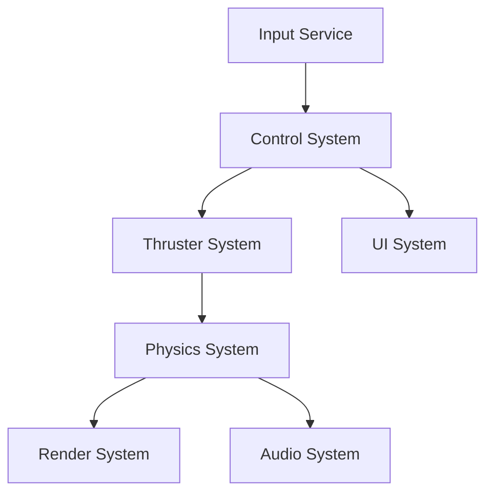

# CGame Engine Architecture Overview

**Document ID**: ARCH_OVERVIEW_V1  
**Date**: July 6, 2025  
**Author**: Development Team

## 🏗️ Core Architecture

CGame is built on a pure Entity-Component-System (ECS) architecture designed for performance, modularity, and maintainability.

### ECS Foundation

**Core Files**:
- [`src/core.h`](../../src/core.h) - World, Entity, Component type definitions
- [`src/core.c`](../../src/core.c) - ECS implementation and component registry

**Key Concepts**:
```c
// Entities are simple IDs
typedef uint32_t EntityID;

// Components are pure data
typedef struct {
    Vector3 position;
    Quaternion rotation; 
    Vector3 scale;
} Transform;

// Systems process components
void physics_system_update(World* world, float delta_time);
```

## 📦 Major Subsystems

### 1. **Physics System**
- **Location**: [`src/system/physics.h`](../../src/system/physics.h)
- **Capabilities**: 6DOF rigid body physics, collision detection
- **Components**: `Physics`, `Transform`, `Collider`
- **Integration**: Force/torque application, constraint solving

### 2. **Rendering Pipeline**
- **Location**: [`src/system/render/`](../../src/system/render/)
- **Architecture**: Multi-pass, layered rendering
- **Key Files**:
  - [`pipeline_manager.h`](../../src/system/render/pipeline_manager.h) - Render orchestration
  - [`render_layers.h`](../../src/system/render/render_layers.h) - Layer definitions
- **Features**: Offscreen rendering, post-processing, UI overlay

### 3. **Input Abstraction**
- **HAL Layer**: [`src/hal/input_hal.h`](../../src/hal/input_hal.h) - Hardware abstraction
- **Service Layer**: [`src/services/input_service.h`](../../src/services/input_service.h) - Game-level input
- **Control Layer**: [`src/system/control.c`](../../src/system/control.c) - Action mapping
- **Pipeline**: Hardware Events → Input Actions → Game Commands

### 4. **Flight Control System**
- **Components**: [`src/component/unified_flight_control.h`](../../src/component/unified_flight_control.h)
- **Thrusters**: [`src/system/thrusters.h`](../../src/system/thrusters.h)
- **Integration**: Input → Control → Thrusters → Physics
- **Enhanced**: Sprint 26 adds semi-autonomous capabilities

## 🔄 System Update Pipeline

### Frame Update Order
```c
void game_update(float delta_time) {
    // 1. Input Processing
    input_service_update(&world->input_service);
    
    // 2. Game Logic Systems
    control_system_update(&world->control_system, delta_time);
    unified_control_system_update(world, delta_time);  // Flight controls
    thruster_system_update(world, delta_time);
    
    // 3. Physics Simulation  
    physics_system_update(world, delta_time);
    
    // 4. Visual Updates
    lod_system_update(world, delta_time);
    render_system_update(world, delta_time);
    
    // 5. Cleanup
    world_cleanup_destroyed_entities(world);
}
```

### System Dependencies


## 📋 Component Catalog

### Movement Components
| Component | File | Purpose |
|-----------|------|---------|
| `Transform` | [`core.h`](../../src/core.h) | Position, rotation, scale |
| `Physics` | [`physics.h`](../../src/system/physics.h) | Mass, forces, constraints |
| `UnifiedFlightControl` | [`unified_flight_control.h`](../../src/component/unified_flight_control.h) | Flight control modes |
| `Thrusters` | [`thrusters.h`](../../src/system/thrusters.h) | Thruster configuration |

### Visual Components  
| Component | File | Purpose |
|-----------|------|---------|
| `Model` | [`model.h`](../../src/component/model.h) | 3D mesh data |
| `Material` | [`material.h`](../../src/component/material.h) | Shading properties |
| `LOD` | [`lod.h`](../../src/component/lod.h) | Level-of-detail settings |

### Specialized Components
| Component | File | Purpose |
|-----------|------|---------|
| `ScriptedFlight` | [`scripted_flight.h`](../../src/component/scripted_flight.h) | Waypoint navigation |
| `AI` | [`ai.h`](../../src/component/ai.h) | AI behavior states |

## 🛠️ Development Tools

### Scene Definition
- **Format**: YAML-based scene description
- **Loader**: [`scene_yaml_loader.h`](../../src/system/scene_yaml_loader.h)
- **Entity Loader**: [`entity_yaml_loader.h`](../../src/system/entity_yaml_loader.h)

### Configuration System
- **Location**: `config/` directory
- **Format**: YAML configuration files
- **Runtime**: Hot-reloadable in debug builds

### Testing Framework
- **Location**: `tests/` directory
- **Structure**: Unit tests per component/system
- **Integration**: Full system integration tests

## 🚀 Performance Characteristics

### ECS Benefits
- **Cache Efficiency**: Components stored in contiguous arrays
- **Parallelization**: Systems can be updated in parallel
- **Modularity**: Easy to add/remove functionality

### Optimization Strategies
- **LOD System**: Reduces update frequency for distant objects
- **Spatial Partitioning**: Efficient collision detection
- **Component Pooling**: Reduces memory allocation overhead

## 🔮 Future Architecture Plans

### Sprint 26: Flight Computer Integration
- Extend `UnifiedFlightControl` with autonomous capabilities
- Add PD controller math library
- Integrate with existing physics pipeline

### Long-term Enhancements
- **Multi-threading**: Parallel system updates
- **Networking**: Multiplayer entity synchronization  
- **Scripting**: Lua integration for gameplay logic
- **Editor**: Visual scene editing tools

---

*This document provides a high-level overview. For detailed implementation, refer to individual component and system documentation.*

**See Also**:
- [`COMPONENT_CATALOG.md`](COMPONENT_CATALOG.md) - Complete component reference
- [`SYSTEM_REFERENCE.md`](../guides/SYSTEM_REFERENCE.md) - Detailed system documentation
- [`PERFORMANCE_GUIDE.md`](PERFORMANCE_GUIDE.md) - Optimization best practices
