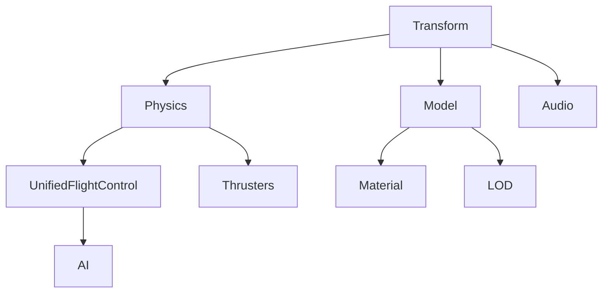

# Component Catalog

**Document ID**: COMP_CATALOG_V1  
**Date**: July 6, 2025  
**Last Updated**: Sprint 26 Planning

## 📦 Core Components

### Transform Component
**File**: [`src/core.h`](../../src/core.h) (lines 25-30)  
**Purpose**: Spatial transformation data for all entities

```c
typedef struct {
    Vector3 position;      // World space position
    Quaternion rotation;   // Orientation quaternion
    Vector3 scale;         // Non-uniform scaling
} Transform;
```

**Usage**: Required by all visible/physical entities  
**Systems**: Physics, Rendering, Control  
**Dependencies**: None

---

### Physics Component  
**File**: [`src/system/physics.h`](../../src/system/physics.h)  
**Purpose**: Rigid body physics properties

```c
typedef struct {
    Vector3 velocity;           // Linear velocity (m/s)
    Vector3 angular_velocity;   // Angular velocity (rad/s)
    float mass;                 // Mass in kg
    Vector3 center_of_mass;     // Local space CoM offset
    Matrix3 inertia_tensor;     // Moment of inertia
    Vector3 accumulated_force;  // Forces this frame
    Vector3 accumulated_torque; // Torques this frame
    bool kinematic;             // Ignore forces if true
} Physics;
```

**Usage**: Entities that move or respond to forces  
**Systems**: Physics System, Thruster System  
**Dependencies**: Transform (required)

---

## 🚁 Flight Control Components

### UnifiedFlightControl Component
**File**: [`src/component/unified_flight_control.h`](../../src/component/unified_flight_control.h)  
**Purpose**: Unified flight control system with multiple modes

```c
typedef struct {
    FlightControlMode mode;     // DIRECT, SCRIPTED, UNIFIED
    
    // Input Processing
    float pitch_input;          // -1.0 to 1.0
    float yaw_input;            // -1.0 to 1.0  
    float roll_input;           // -1.0 to 1.0
    float thrust_input;         // 0.0 to 1.0
    float strafe_input;         // -1.0 to 1.0
    float vertical_input;       // -1.0 to 1.0
    
    // Control Parameters
    float sensitivity;          // Input sensitivity multiplier
    float damping;              // Control damping factor
    
    // Sprint 26: Flight Assist Extension
    struct {
        bool enabled;           // Flight assist active
        Vector3 target_position; // 3D target in world space
        float sphere_radius;    // Targeting sphere radius
        float kp_position;      // Position control gain
        float kd_velocity;      // Velocity damping gain
        float bank_angle;       // Visual banking angle
    } flight_assist;
} UnifiedFlightControl;
```

**Usage**: Player-controlled and AI ships  
**Systems**: Unified Control System (Sprint 26 enhanced)  
**Dependencies**: Transform, Physics  
**Enhanced**: Sprint 26 adds semi-autonomous capabilities

---

### Thrusters Component
**File**: [`src/system/thrusters.h`](../../src/system/thrusters.h)  
**Purpose**: Thruster configuration and control

```c
typedef struct {
    // Thruster Configuration
    int num_thrusters;
    struct {
        Vector3 position;       // Local space position
        Vector3 direction;      // Local space thrust direction
        float max_force;        // Maximum thrust force (N)
        float current_output;   // Current output (0.0-1.0)
        bool active;            // Thruster operational
    } thrusters[MAX_THRUSTERS];
    
    // Control Outputs
    float thrust_forward;       // Forward/backward thrust
    float thrust_strafe;        // Left/right thrust  
    float thrust_vertical;      // Up/down thrust
    float torque_pitch;         // Pitch control torque
    float torque_yaw;           // Yaw control torque
    float torque_roll;          // Roll control torque
} Thrusters;
```

**Usage**: Entities with reaction control systems  
**Systems**: Thruster System, Control System  
**Dependencies**: Transform, Physics

---

### ScriptedFlight Component
**File**: [`src/component/scripted_flight.h`](../../src/component/scripted_flight.h)  
**Purpose**: Waypoint-based automated flight paths

```c
typedef struct {
    // Waypoint System
    int num_waypoints;
    Vector3 waypoints[MAX_WAYPOINTS];
    int current_waypoint;
    float arrival_tolerance;    // Distance for waypoint completion
    
    // Path Following
    Vector3 desired_velocity;   // Calculated desired velocity
    float max_speed;            // Maximum flight speed
    float acceleration;         // Acceleration rate
    
    // State
    bool active;                // Script running
    bool loop;                  // Loop back to start
    FlightState state;          // APPROACHING, ARRIVED, etc.
} ScriptedFlight;
```

**Usage**: Automated ships, cutscenes, AI behavior  
**Systems**: Scripted Flight System  
**Dependencies**: Transform, Physics

---

## 🎨 Visual Components

### Model Component
**File**: [`src/component/model.h`](../../src/component/model.h)  
**Purpose**: 3D mesh and animation data

```c
typedef struct {
    uint32_t mesh_id;           // Reference to mesh resource
    uint32_t material_id;       // Reference to material
    Matrix4 local_transform;    // Local transformation matrix
    bool visible;               // Rendering enabled
    float animation_time;       // Current animation time
} Model;
```

**Usage**: All rendered geometry  
**Systems**: Render System, LOD System  
**Dependencies**: Transform

---

### Material Component  
**File**: [`src/component/material.h`](../../src/component/material.h)  
**Purpose**: Surface rendering properties

```c
typedef struct {
    // PBR Material Properties
    Vector3 albedo;             // Base color (RGB)
    float metallic;             // Metallic factor (0.0-1.0)
    float roughness;            // Surface roughness (0.0-1.0)
    float emission;             // Emission intensity
    
    // Texture References
    uint32_t albedo_texture;    // Color texture ID
    uint32_t normal_texture;    // Normal map ID
    uint32_t roughness_texture; // Roughness map ID
    
    // Rendering Flags
    bool alpha_blend;           // Enable alpha blending
    bool double_sided;          // Render both sides
} Material;
```

**Usage**: Entities with custom materials  
**Systems**: Render System  
**Dependencies**: Model (optional)

---

### LOD Component
**File**: [`src/component/lod.h`](../../src/component/lod.h)  
**Purpose**: Level-of-detail optimization

```c
typedef struct {
    // LOD Levels
    int num_levels;
    struct {
        float distance;         // Switch distance
        uint32_t mesh_id;       // Mesh for this LOD level
        float update_rate;      // System update frequency
    } levels[MAX_LOD_LEVELS];
    
    // Current State
    int current_level;          // Active LOD level
    float last_update_time;     // Last system update
    float distance_to_camera;   // Current camera distance
} LOD;
```

**Usage**: Performance optimization for complex models  
**Systems**: LOD System, Render System  
**Dependencies**: Transform, Model

---

## 🤖 AI & Behavior Components

### AI Component
**File**: [`src/component/ai.h`](../../src/component/ai.h)  
**Purpose**: AI behavior state and decision making

```c
typedef struct {
    AIState current_state;      // Current behavior state
    AIState previous_state;     // Previous state for transitions
    float state_time;           // Time in current state
    
    // Behavior Parameters
    float aggression;           // AI aggression level (0.0-1.0)
    float skill_level;          // Pilot skill (0.0-1.0)
    float reaction_time;        // Response delay (seconds)
    
    // Targeting
    EntityID target_entity;     // Current target
    Vector3 target_position;    // Target location
    float target_distance;      // Distance to target
    
    // Decision Making
    float decision_timer;       // Time until next decision
    AIGoal primary_goal;        // Main objective
    AIGoal secondary_goal;      // Fallback objective
} AI;
```

**Usage**: Non-player controlled entities  
**Systems**: AI System  
**Dependencies**: Transform, UnifiedFlightControl (for ships)

---

## 📊 Specialized Components

### Health Component
**File**: [`src/component/health.h`](../../src/component/health.h)  
**Purpose**: Damage and destruction tracking

```c
typedef struct {
    float max_health;           // Maximum health points
    float current_health;       // Current health
    float armor;                // Damage reduction factor
    float shield;               // Energy shield strength
    float shield_regen_rate;    // Shield regeneration per second
    
    // Damage State
    bool destroyed;             // Entity destroyed
    float destruction_timer;    // Time until cleanup
    Vector3 last_damage_position; // Location of last damage
} Health;
```

**Usage**: Damageable entities  
**Systems**: Combat System, Health System  
**Dependencies**: None

---

### Audio Component
**File**: [`src/component/audio.h`](../../src/component/audio.h)  
**Purpose**: 3D positional audio sources

```c
typedef struct {
    uint32_t sound_id;          // Reference to sound resource
    bool playing;               // Currently playing
    bool looping;               // Loop playback
    float volume;               // Volume level (0.0-1.0)
    float pitch;                // Pitch multiplier
    float max_distance;         // Audio falloff distance
    bool positional;            // 3D positional audio
} Audio;
```

**Usage**: Entities that produce sound  
**Systems**: Audio System  
**Dependencies**: Transform (for positional audio)

---

## 🔗 Component Relationships

### Required Dependencies


### System Processing Order
1. **Input Processing**: Update input states
2. **AI/Control**: Process AI decisions and control inputs  
3. **Physics**: Apply forces and integrate motion
4. **Visual**: Update LOD, animations, rendering
5. **Audio**: Update 3D audio positions

---

## 📝 Usage Guidelines

### Adding New Components
1. Define component struct in appropriate header
2. Register in component system (`src/core.c`)
3. Implement creation/destruction functions
4. Add to relevant systems
5. Update this catalog

### Component Design Principles
- **Pure Data**: Components contain only data, no logic
- **Cache Friendly**: Group related data together
- **Minimal Dependencies**: Avoid deep dependency chains
- **Performance**: Consider memory layout and access patterns

---

*For system-specific documentation, see [`SYSTEM_REFERENCE.md`](../guides/SYSTEM_REFERENCE.md)*

**See Also**:
- [`ARCHITECTURE_OVERVIEW.md`](ARCHITECTURE_OVERVIEW.md) - High-level architecture
- [`PERFORMANCE_GUIDE.md`](PERFORMANCE_GUIDE.md) - Optimization techniques
- [Sprint 26 Documentation](../sprints/active/SPRINT_26_SEMI_AUTONOMOUS_FLIGHT.md) - Latest enhancements
